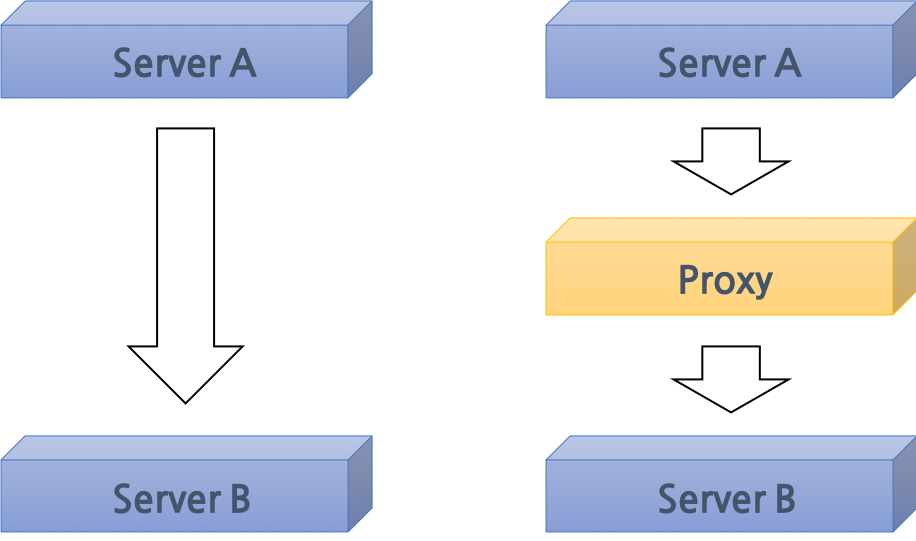

Proxy 에 대해서 찾아볼 기회가 생겨 관련 내용을 정리해보기로 했다.

프록시, proxy는 사전적으로 정의하길 `대리`라고 한다.

네트워크 분야에서는 request를 보내는 클라이언트와 response를 답해줘야 하는 서버 사이에서 중개인 역할을 해주는 서버를 의미한다.

(클라이언트도 하나의 서버라고 본다면) 두 서버가 직접적으로 연결이 될 수 없을 때 (보안적인 이슈라던지) 대리로 통신을 해줄 수 있도록 하기 위해 활용한다.

프록시 서버가 처음 생긴 배경은 인터넷 환경이 좋지 못한 곳에서 인터넷 서핑을 보다 원활하게 할 수 있도록 **인터넷 속도의 향상**이었다.

(비록 많은 이들이 프록시 서버를 본인의 IP를 숨기고 차단된 사이트를 우회하기 위해 생겼다고 생각하겠지만..)

본래의 목적인 인터넷 속도의 향상을 하기 위해서 프록시 서버는 캐싱을 활용한다.

프록시 서버에 요청된 내용을 캐시로 저장해두고, 똑같은 내용의 요청이 들어왔을 때 새로운 외부 접속을 하는 것이 아니라 캐싱 내용을 전달해주기만 하면 된다.

따라서 같은 요청이 주기적 및 반복적으로 들어오는 환경에서는 해당 프록시 서버를 활용하는 것이 인터넷 속도 향상을 기대할 수 있을 것이다.

하지만, 현실적으로는 서버A - 프록시 서버, 다시 프록시 서버 - 서버B의 구조로 통신을 두번하게 되기 때문에 속도가 오히려 떨어지는 상황이 벌어질 수도 있다.

Reference:
- https://bit.ly/2DGcJ6u
- https://bit.ly/2Agw62O